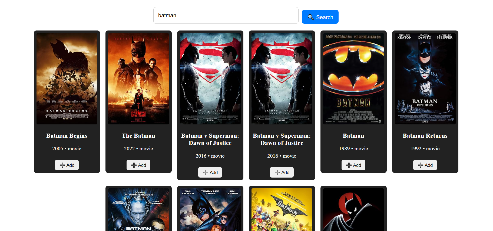
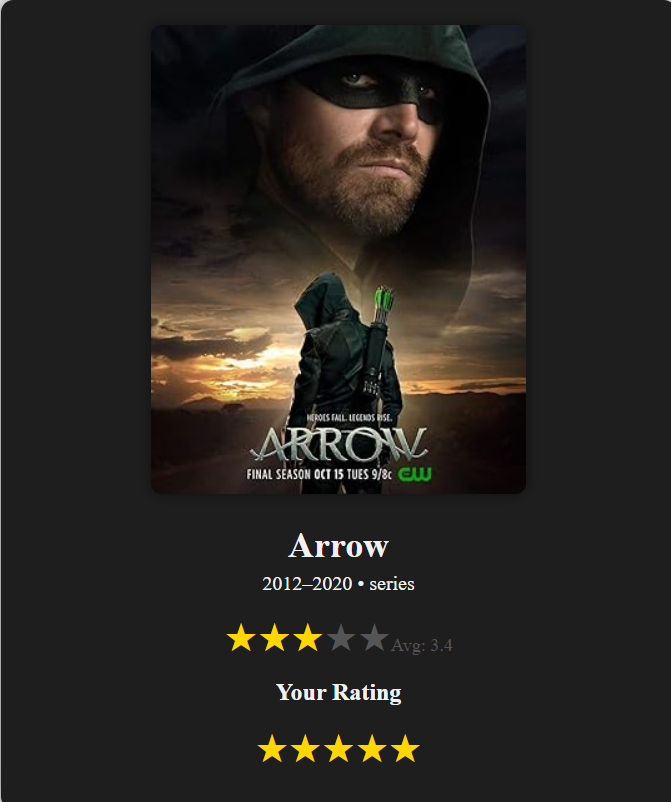
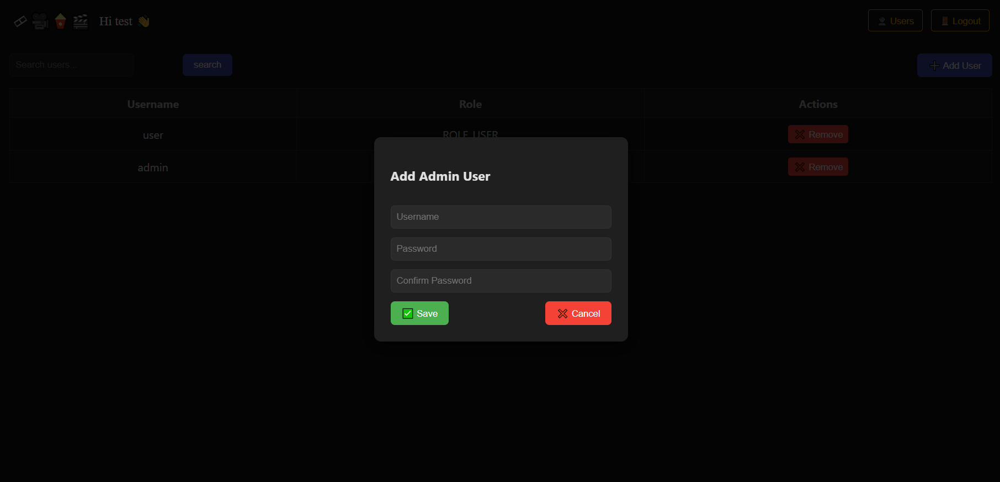

# 🎬 IMDB Clone

A full-stack IMDB-like web application built with **Angular** (frontend) and **Spring Boot** (backend).
The app allows users to search movies, view details, and rate them, while admins have additional control over movies and users.

---
## 🎥 Demo

[](https://www.youtube.com/watch?v=AS8XkDAojc0)

## 🎥 Demo

👉 [Watch the demo on YouTube](https://www.youtube.com/watch?v=AS8XkDAojc0)
---
## 🚀 Features

### 👥 Users

* Search for movies (via **OMDb API**).
* View movie details:

  * Title, Year, Poster, and Type.
  * **Total Average Rating** (from all users).
  * **Personal Rating** (set/update your own rating).
* Rate movies and see ratings update instantly.

### 🛠️ Admins

Admins have full control in addition to normal user features:

* ➕ Add movies.
* ❌ Remove movies.
* 👤 Manage users:

  * View all users.
  * Add a new user with roles.
  * Remove users.

### 🔐 Authentication & Authorization

* JWT-based authentication.
* Roles: `ROLE_USER`, `ROLE_ADMIN`.
* Secure pages:

  * User-only: Search, rate, and view movies.
  * Admin-only: Manage movies & users.

---

## 🖼️ Screenshots

### 🎞️ Movies Page

Users can search, view, and rate movies.
Admins can also add/remove movies.



---

### ⭐ Movie Details with Ratings

Displays **average rating** and **personal rating**.



---

### 👤 Users Management (Admin Only)

Admins can manage users and roles.



---

## 🛠️ Tech Stack

**Frontend (Angular)**

* Angular 15+
* Bootstrap / CSS for styling
* `jwt-decode` for parsing JWT tokens
* REST API integration with backend
* OMDb API for movie data

**Backend (Spring Boot)**

* Spring Boot 3+
* Spring Security with JWT authentication
* JPA/Hibernate + Database (e.g., PostgreSQL/MySQL)
* REST APIs for authentication, movies, ratings, and user management

---

## ⚙️ Installation

### 📌 Backend (Spring Boot)

1. Clone the repo:

   ```bash
   git clone https://github.com/mohamed-shalash/IMDB-clone.git
   cd IMDB-clone/backend
   ```
2. Configure database in `application.properties`.
3. Run the backend:

   ```bash
   mvn spring-boot:run
   ```

---

### 📌 Frontend (Angular)

1. Go to frontend folder:

   ```bash
   cd IMDB-clone/frontend
   ```
2. Install dependencies:

   ```bash
   npm install
   npm install jwt-decode
   ```
3. . Start Angular app:

   ```bash
   ng serve
   ```
4. Open [http://localhost:4200](http://localhost:4200)

---

## 🔑 Default Roles & Access

* **Admin**

  * Username: `admin`
  * Role: `ROLE_ADMIN`
* **User**

  * Username: `user`
  * Role: `ROLE_USER`

---

## 📡 API Integration

* 🎬 **OMDb API**: Fetches movie info (poster, title, year, type).
* 🔐 **JWT Authentication**: Manages secure access with tokens.


